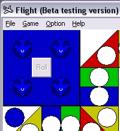

<div align="center">

## Classic Aeroplane Game


</div>

### Description

One of my favourite childhood game is now available in PC Windows version. I started this project in August 2003 as a hobby and complete it after stop for a long time. It is a simple game made in VB6 using basic conntrols like Image, Picturebox, Shape, Timer, Frame, Option button and command button only. I also use Module for Read/Write text file and AI function. I try to make some simple AI and I hope I can improve the AI to become smarter in the future. This game is not using DirectX or bitblt. I used some GIF images for the planes. Actually I have been long time not playing this game and forgot about Rules of the game. So I make it Roll the die only once eventhough you have six. Your plane jumps if you stop at a Path which is same colour as yours. If the Path occupied by other plane, you can kick it but if it occupied by more than 1 opponent's plane, then your plane will be kicked! I include 2 WAV sounds. You 'll hear "Oh Ou" ICQ sound when a plane is kicked. There are 3 mode; One player, 4 human players and 4 AI Simulation mode. You can set custom name for each player or use Colour. You can set default colour to start game or set as Random. You can Load/Save your game too. Click Start game and click with your Mouse pointer. Press 'Esc' to show/hide menu. I made this game view at minimum 800x600 screen resolution and center when you maximized the form. Please Vote if you like it. Send me feedback so I can improve the game in future.
 
### More Info
 
User mouse clicks.

Basic VB6 knowledge. Experience of playing the game is not needed as the interface and gameplay is user-friendly.

Some animation.

For passing time. May cause psychological and emotional effects if play too long. Possible to improve a Child IQ, Mathematics and Memory as user will expose to Numbers, Colours and Animation.


<span>             |<span>
---                |---
**Submitted On**   |2006-12-01 20:19:46
**By**             |[Aeric](https://github.com/Planet-Source-Code/PSCIndex/blob/master/ByAuthor/aeric.md)
**Level**          |Beginner
**User Rating**    |5.0 (15 globes from 3 users)
**Compatibility**  |VB 6\.0
**Category**       |[Games](https://github.com/Planet-Source-Code/PSCIndex/blob/master/ByCategory/games__1-38.md)
**World**          |[Visual Basic](https://github.com/Planet-Source-Code/PSCIndex/blob/master/ByWorld/visual-basic.md)
**Archive File**   |[Classic\_Ae2034511222006\.zip](https://github.com/Planet-Source-Code/aeric-classic-aeroplane-game__1-67230/archive/master.zip)

### API Declarations

```
'For windows sound
Declare Function PlayWave Lib "winmm" Alias "sndPlaySoundA" _
(ByVal FileName As String, ByVal flags As Long) As Long
```


